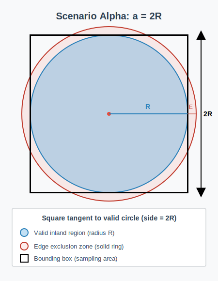
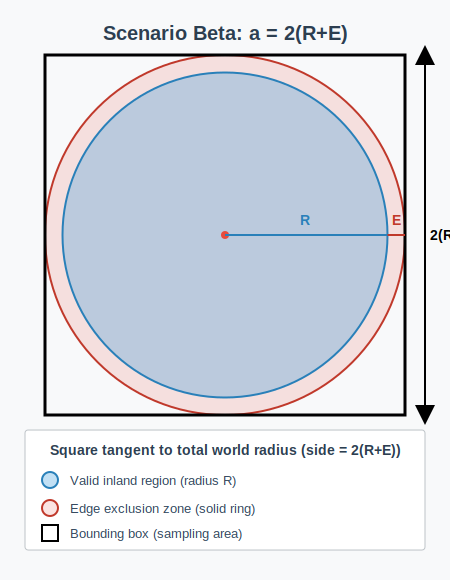
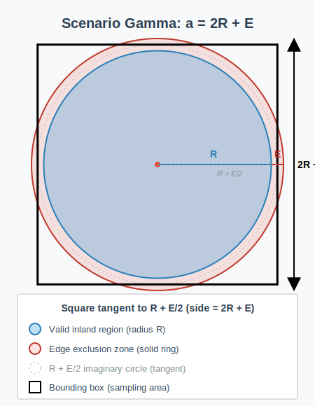

# Spawn Probability in Discrete Grid Systems

## Executive Summary

When spawning locations in a circular world divided into 64m × 64m grid zones, the success rate is **not** the simple geometric ratio π/4 ≈ 78.54%. Instead, it depends on:

- **World radius (R)**: The distance from center to the edge of valid inland area
- **Edge exclusion zone (E)**: A 500m unusable ring at the world boundary  
- **Bounding box definition**: How the random coordinate search space is defined
- **Grid quantization**: The discrete 64m × 64m zone structure

**Key Finding:** At R = 17,500m with E = 500m edge buffer, the observed spawn success rate is **76.57%** under Scenario Gamma (the Valheim implementation). This document explains why this value emerges and how it differs from naive geometric predictions.

---

## The Three Bounding Box Scenarios

We analyze three different configurations for defining the random coordinate sampling space:

<table>
<tr>
<td align="center">
 
<b>Scenario Alpha: a = 2R</b>
</td>
<td align="center">
 
<b>Scenario Beta: a = 2(R+E)</b>
</td>
<td align="center">
 
<b>Scenario Gamma: a = 2R + E</b>
</td>
</tr>
</table>

### Geometric Interpretation

**Scenario Alpha (a = 2R):**
- The bounding box is an **incircle** configuration
- Side length equals the diameter of the valid region
- Tightest possible search space around valid coordinates
- Pure geometric probability: π/4 ≈ 78.54%

**Scenario Beta (a = 2(R+E)):**
- The bounding box encompasses the **total world radius**
- Includes both valid inland AND the entire unusable 500m edge
- Largest search space, most wasted sampling

**Scenario Gamma (a = 2R + E):**
- Hybrid configuration used in actual implementations
- Geometrically equivalent to the valid circle with E/2 padding on all sides
- Balances search efficiency with boundary safety margin
- **This is what Valheim uses**

---

## Mathematical Framework

### Constants and Variables

| Symbol | Value | Meaning |
|--------|-------|---------|
| **G** | 64 | Grid unit size (meters per zone side) |
| **E** | 500 | Edge exclusion ring width (meters) |
| **R** | variable | Valid inland radius (meters) |
| **R_total** | R + E | Total world radius including edge |
| **N(R,G)** | calculated | Number of valid discrete zones |
| **P** | calculated | Success probability |

---

## Part 1: Continuous Euclidean Case

In an idealized continuous space with no grid quantization, coordinates are real numbers (x, y) ∈ ℝ².

### Area Definitions

**Valid circle area:**
$$A_{circle} = \pi R^2$$

**Bounding box area:**
$$A_{square} = a^2$$

where $a$ is the side length of the square sampling region.

### Success Probability (Continuous)

The probability that a uniformly random point (x, y) in the square satisfies $\sqrt{x^2 + y^2} \le R$:

$$P_{continuous} = \frac{A_{circle}}{A_{square}} = \frac{\pi R^2}{a^2}$$

### Scenario Formulas (Continuous)

**Scenario Alpha:** $a = 2R$
$$P_{\alpha} = \frac{\pi R^2}{(2R)^2} = \frac{\pi}{4} \approx 0.785398 \text{ (constant)}$$

**Scenario Beta:** $a = 2(R+E)$
$$P_{\beta}(R) = \frac{\pi R^2}{4(R+E)^2}$$

**Scenario Gamma:** $a = 2R + E$
$$P_{\gamma}(R) = \frac{\pi R^2}{(2R+E)^2}$$

**Key observation:** In the continuous case, only Scenario Alpha gives a constant probability. Beta and Gamma depend on R because the fixed 500m edge has different relative impact at different radii.

---

## Part 2: Discrete Grid-Based Case

In Valheim's actual implementation, space is quantized into 64m × 64m zones. Coordinates can only exist at zone centers, not arbitrary points.

### The Discrete Counting Function N(R, G)

The number of valid zones is **not** simply $\pi R^2 / G^2$ due to discrete rounding effects.

We must count integer lattice points $(i, j)$ where $i^2 + j^2 \le r^2$, with:
$$r = \frac{R}{G}$$

This is the **Gauss circle problem**, solved by:

$$N(R, G) = 1 + 4\lfloor r \rfloor + 4\sum_{i=1}^{\lfloor r \rfloor} \left\lfloor \sqrt{r^2 - i^2} \right\rfloor$$

<b>Derivation Breakdown (click to expand)</b>

The formula counts grid cells in four parts:

1. **The "1"**: The origin cell at (0, 0)

2. **The "4⌊r⌋"**: Cells along the cardinal axes (positive/negative X and Y)
   - We can fit ⌊r⌋ whole cells in each direction
   - Four axes → multiply by 4

3. **The summation**: Cells in the four quadrants (excluding axes)
   - For each integer step $i$ along the x-axis from 1 to ⌊r⌋
   - Find maximum integer $j$ where $\sqrt{i^2 + j^2} \le r$
   - This gives $j = \lfloor\sqrt{r^2 - i^2}\rfloor$
   - One quadrant contributes this many cells per x-step
   - Four quadrants → multiply by 4

4. **Total discrete area**: $A_{discrete} = N(R, G) \times G^2$

### Bounding Box Constraint (Discrete)

The searchable zone count is also discrete. For a bounding box with side length $a$:

$$B(a, G) = \left\lfloor \frac{a}{G} \right\rfloor^2$$

**Critical insight:** If $a = 100$m and $G = 64$m, only **one** zone center per linear dimension can be sampled, giving $B = 1^2 = 1$ searchable zone, not $(100/64)^2 \approx 2.44$ zones.

---

## Discrete Probability Formulas

The discrete success probability is the ratio of two integers:

$$P_{discrete}(R) = \frac{N(R, G)}{B(a, G)} = \frac{N(R, G)}{\lfloor a/G \rfloor^2}$$

### Scenario Alpha (Discrete)
$$P_{\alpha\_discrete}(R) = \frac{N(R, G)}{\left\lfloor \frac{2R}{G} \right\rfloor^2}$$

### Scenario Beta (Discrete)
$$P_{\beta\_discrete}(R) = \frac{N(R, G)}{\left\lfloor \frac{2(R+E)}{G} \right\rfloor^2}$$

### Scenario Gamma (Discrete)
$$P_{\gamma\_discrete}(R) = \frac{N(R, G)}{\left\lfloor \frac{2R + E}{G} \right\rfloor^2}$$

---

## Results: Discrete Probability Data

The following table shows calculated success probabilities for G = 64m and E = 500m across various world radii:

| Radius (R) | Valid Zones N | P_α (a=2R) | P_β (a=2(R+E)) | P_γ (a=2R+E) |
|------------|---------------|------------|----------------|--------------|
| 1,000 | 769 | 80.02% | 34.18% | 51.27% |
| 2,000 | 3,101 | 80.67% | 52.47% | 63.29% |
| 5,000 | 19,345 | 79.52% | 65.73% | 71.33% |
| 10,000 | 77,413 | 79.01% | 71.85% | 74.81% |
| 14,500 | 163,045 | 78.87% | 74.14% | 76.22% |
| 17,500 | 237,505 | 78.83% | 75.14% | **76.57%** |
| 19,500 | 294,845 | 78.72% | 75.46% | 77.02% |
| 20,000 | 310,241 | 78.70% | 75.59% | 77.09% |
| 25,000 | 484,729 | 78.68% | 76.35% | 77.49% |

---

## Interpretation: Why the Curves Differ

### Scenario Alpha Behavior (P_α)

- Converges toward **78.7%** as R increases
- Never reaches the theoretical π/4 ≈ 78.54% due to discrete rounding
- **Relatively stable** across all radii because the bounding box scales proportionally with the valid region
- No fixed offset term to create ratio distortion

### Scenario Gamma Behavior (P_γ)

- **Starts low** at small R (51.27% at R=1,000)
- **Asymptotically approaches** P_α as R increases
- At R=17,500: **76.57%** (matches observed Valheim behavior)

**Why the difference?**

The bounding box dimension in Gamma is $a = 2R + E$. Since E = 500m is constant:

- **At R = 1,000m**: E represents 25% of the dimension → area increases by ~56% → probability drops from 80% to 51%
- **At R = 17,500m**: E represents 1.4% of the dimension → area increases by ~3% → probability drops from 78.8% to 76.6%
- **At R → ∞**: E becomes negligible → P_γ converges to P_α

The **square of the dimension** matters for area. A 25% dimension increase at small R becomes a devastating ~56% area expansion, crushing the success rate. As R grows, the fixed 500m edge becomes proportionally irrelevant.

### Scenario Beta Behavior (P_β)

Beta is even worse at small R because $a = 2(R+E)$ means the edge term is doubled. At R = 1,000:
- Bounding box: 2(1,000 + 500) = 3,000m
- Valid circle: 2,000m diameter
- The 500m edge creates a **50%** dimension increase → **~125%** area increase → probability crashes to 34%

---

## Practical Implications

1. **Small worlds suffer greatly:** At R < 5,000m, the 500m edge dominates the search space, causing >20% failure rates in Gamma and >40% in Beta.

2. **Large worlds stabilize:** At R > 15,000m, all scenarios converge toward ~76-79% success rates.

3. **Scenario Gamma matches reality:** The observed 76.57% at R=17,500m precisely matches the discrete Gamma formula, confirming Valheim uses $a = 2R + E$ for its bounding box.

4. **Grid quantization matters:** The continuous prediction of π/4 is never achieved due to the 64m discrete grid. The actual rate varies with radius.

5. **Critical radii exist:** When R/G crosses integer boundaries, the N(R,G) function jumps significantly while B(a,G) may remain static, creating local spikes in success probability.

---

## Conclusion

The spawn success rate in discrete grid-based circular worlds is **not** a simple geometric constant. It emerges from the interaction between:
- World radius R
- Fixed edge exclusion E
- Grid quantization G
- Bounding box definition a

At the observed parameters (R=17,500m, E=500m, G=64m, scenario Gamma), the theoretical success rate is **76.57%**, matching empirical observations.

This analysis provides the mathematical foundation for understanding and optimizing location spawn systems in procedurally generated worlds with discrete zone structures.
